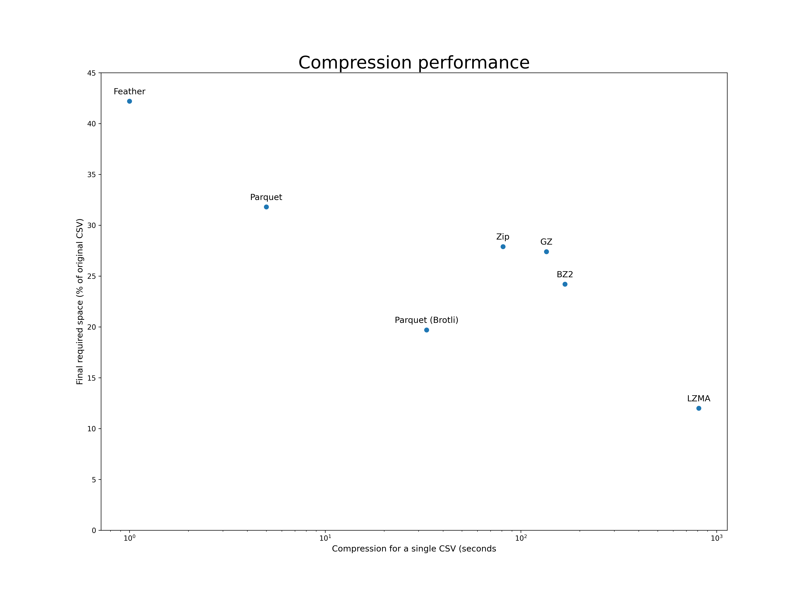

**************
Data ingestion
**************

The raw data provided by HANEL comes in a format that is inadequate for most, if not all, analytics tasks performed
with the data. For this reason,  processing the data into a format appropriate for our use is the first step in the
generation of any analytical outputs.

This process is commonly known as `Extract, Transform & Load <https://en.wikipedia.org/wiki/Extract,_transform,_load>`_
and can (should) be designed with the analytics use cases in mind. However, there is absolutely no need to run this
process more than once on the raw data

.. _hanel_data:

HANEL's raw data
================

The data received from HANEL has three important characteristics that make it inadequate for use for analytics in its
original format:

1. It is sorted by timestamp rather than by vehicle, while most of the processing of the data is done byy vehicle
2. It is in CSV format, which results in large files that take too much time to be loaded
3. Contains redundant (vehicle type for each GPS record) and inefficient data types for work in memory (vehicle type
   and vehicle identifier are long strings)

The data is organized in a directory for each calendar day, inside of which a series of CSV files with 10 million
records each is placed. Each one of these data files has the following format.

::

    vehicle,datetime,speed,x,y,heading,VehicleType
    bOGJIXjzWD29JY24y3gT/g==,1585780315,10.0,106.63020324707031,10.768750190734863,181.1,Xe chưa phân loại
    jKYkHRwBCATrWl4DkdWKFg==,1585780321,41.0,106.79299926757812,10.86571979522705,130.0,Xe chưa phân loại
    LtonCPx/mO94YI9Kilaslg==,1585766618,44.0,105.91528,21.0087483333,38.0,Xe chưa phân loại
    r9uDV7PxFpDQCxafwlWM4Q==,1585780310,0.0,106.88480377197266,10.93822956085205,226.5,Xe chưa phân loại
    sERvntCTgLHdiG4PVypveA==,1585780318,0.0,106.80950164794922,10.780980110168457,338.6,Xe chưa phân loại
    dS3IR9PjBoe3TXfTXM0g3Q==,1585776052,0.0,105.819625,10.134875,296.0,Xe chưa phân loại
    nsqu7D3lW41PTR5h3syr+g==,1585780336,44.0,106.11979675292969,20.91621971130371,78.5,Xe chưa phân loại
    n3sdB/si5JemE8XMifymLA==,1585766618,0.0,105.2251966667,21.1300333333,272.0,Xe chưa phân loại

.. _backup:

Backup
======

Since the process of obtaining data from HANEL was expensive and time-consuming, it was reasonable to
safeguard the data by backing up the raw data received in a format closest to the original so we
could begin the processing from scratch at any point in time.

Backing up the data in its original CSV format would require an unreasonable amount of disk space, so
we did a little investigation on different formats we could use for such task, for which the results
are shown below.

All these tests were done with Pandas, as it provides a simple interface for loading the original CSV
and saving in all of these formats and the times are for converting a single 10 million row CSV.

All all these formats, Zip, GZ and BZ2 are dominated by other alternatives, and therefore were discarded
from further consideration.  Feather provided amazing compression speed (~1.5s), but the level of
compression was too low, at about 42% of the original size.

On the other end of the spectrum, LZMA was able to compress the data to roughly 12% of its original size,
but took in excess of 800 seconds to do so, which would require over a day of processing time to compress
one day of data (single threaded).

We have then settled on using Parquet with Brotli compression, which was able to compress the data to
just under 20% of its original size (19.7%), doing that in about 33s. When processing the data with multiple
threads, it was possible to backup an entire month worth of data in less than 4h.

.. _etl:

Extract, Load & Transform
=========================

Due to the volume of data and its organization, the data ingestion was divided into two phases:

1. Separation of the original data into one file per vehicle
2. Consolidation of daily files into one file per vehicle per month

.. _datalake_database:
Reference database
------------------

Although we have opted to leave all the GPS data on disks as compressed files, as it will be discussed in the
following sessions, we rely on the existence of a reference database to maintain a record of the correspondence between
the original vehicle identifiers and their integer counterparts on our system, as well as the vehicle type of each
of the vehicles for which data has been loaded.

We also leverage the database to store summary statistics of for the data, particularly on the table *vehicle_days*,
where we have one record for each day a vehicle has been active. For each one of these records we also include
the number of GPS pings, the first and last active instants and the bounding box of the vehicle's GPS trace as a
Polygon.

The point of this table is to provide a more powerful index of the data, as it allows for the filtering of the raw
data to vehicles that operate during a certain period and region, as well as discard those which operate during a
period too short or with too few GPS records to be deemed useful.

.. _daily_processing:
Separating traces per vehicle
-----------------------------
The first process in the ingestion of the raw data provided by HANEL is to separate all data in separate datafiles
for each vehicle available in the dataset. Since a large portion of the work is data compression

The data format chosen for the vehicle specific datasets was GZIP, as Pandas allows one to stream the data into
pre-existing files, enabling us to process each one of (or a set of) the original datasets at a time, cumulatively
streaming the data into the original data files.

During this step of the process a new unique integer identifier is assigned to each vehicle in the first time they
are recorded, or their previously assigned identifier is retrieved from the database. During this step we also
verify if a vehicle type has previously been assigned to each unique vehicle and update the vehicle type in the
database whenever appropriate, as often the vehicle type available in large portions of the entries for each vehicle
is the Vietnamese equivalent to "unclassified vehicle".1

.. _monthly_processing:
Monthly data
------------

* Sort the data
* Populate the vehicle_days table

.. _data_testing:
Data testing
------------

